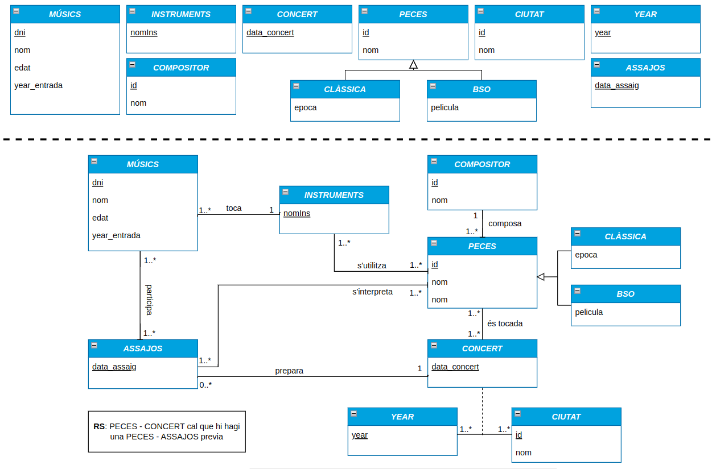

# DISSENY I ADMINISTRACIÓ DE BASES DE DADES
## CONTROL PARCIAL

### Problema 1 [4 punts; màxim: 45 minuts]

La prestigiosa Orquestra Filharmònica de Viena vol remodelar la base de dades que la
gestiona. Concretament, vol tenir informació personal dels músics que hi toquen. De
cada músic es vol conèixer el nom, el DNI que els identifica, l'edat, l'instrument que toca
i l'any d'entrada a l'orquestra. Els instruments es diferencien pel seu nom.

El funcionament de la Filharmònica consisteix en unes quantes jornades d'assaig prèvies
a cada concert. En aquests assajos s'interpreten un conjunt de peces.

Com és una orquestra molt professional, vol tenir una planificació de tots els assajos que
es faran abans de cada concert. Dels assajos se sap la data i les peces que s'interpretaran.
Mai es fan dos assajos en un mateix dia.

Donat que és un gran grup de músics, no sempre participen els mateixos als assajos, 1 es
vol saber quins participen en cadascun.

De cada concert també es vol saber la data i les peces que s'interpretaran, 1 la ciutat on
es durà a terme. Tampoc es faran dos concerts en un mateix dia. I no es pot interpretar
cap peça que no s'hagi interpretat en almenys un dels assajos previs del concert.

Per cada pega volen conèixer en quants concerts diferents s'ha tocat. Generalment, la
Filharmònica està molt enfocada a la interpretació de peces clàssiques, però recentment
ha començat a tocar també Bandes Sonores de pel·lícules. En qualsevol cas, cada peca
s'identifica amb un identificador, té un nom i també es vol tenir constància del seu
compositor. Només en el cas que sigui una peca clàssica es vol saber a quina època
pertany. 1 només en el cas que sigui una Banda Sonora es vol saber de quina pel·lícula
es tracta. També volen saber els instruments necessaris per interpretar cada peça.

Després de ser acusats de tocar molt en certes ciutats i no trepitjar-ne d'altres, han decidit
que no es farà un concert dues vegades a la mateixa ciutat en un mateix any. D'aquesta
manera evitaran crítiques i altres entrebancs no desitjats.

Tant els compositors com les ciutats poden tenir noms repetits, per això és millor usar
un camp id numèric autoincremental per diferenciar-los.

Proposa un model de classes UML indicant, si és el cas, quines condicions de l'enunciat no
es reflecteixen de manera directa en el teu model mitjançant Restriccions Semàntiques.

## SOLUCIÓ

