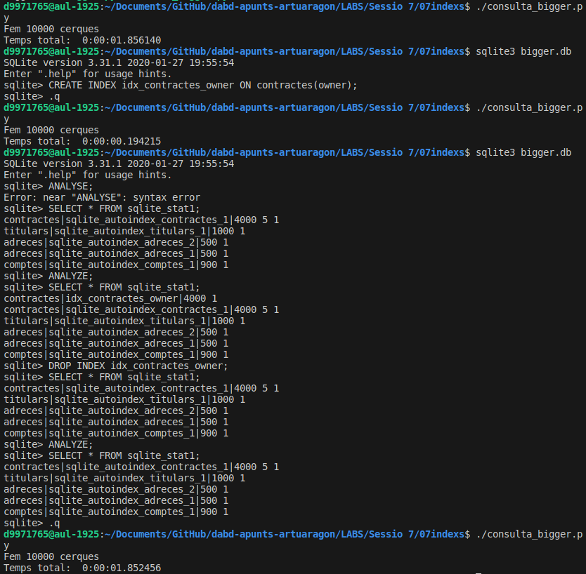
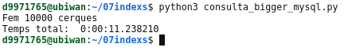

#  dabd-apunts-artuaragon | Sessió 7 | DL 29 ABRIL 2024 | 

1) Executa l'script bigger.py per crear la base de dades bigger.db que conté 4 taules (comptes, adreces, titulars, contractes) amb molts registres. Mira't el codi de l'script per veure com es pot omplir una base de dades relacional per tenir dades similars a un entorn de producció, fixa't que s'usa la llibreria random per generar números aleatoris i la llibreria faker per crear dades inventades similars a les de la realitat (noms, adreces, ciutats, telèfons, emails, etc., tens un exemple a l'annex 1).

2) Obre la base de dades bigger.db amb el client de terminal sqlite3 i executa aquestes comandes (la comanda pragma index_list(taula) permet consultar els índexs que hi ha associats a la taula):

```
.headers on
pragma index_list(comptes);
pragma index_list(adreces);
pragma index_list(titulars);
pragma index_list(contractes);
```
Fixa't que comptes, titulars i contractes tenen un índex de sistema (degut a la primary key) i adreces en té dos (té una primary key i una unique).

Dins de System Catalogue de SQLite tenim dos taules de només lectura amb informació del sistema:

    sqlite_master: Definició de les taules i índexs de la base de dades, amb la rootpage d'on es troba situat l'arrel del B-tree corresponent. Mira l'annex 2 per entendre que signifiquen les columnes d'aquesta taula.
    sqlite_stat1: Estadístiques de cadascun dels índexs (o de la taula si no en té cap): Nombre de registres total i nombre de registres mig que obtindríem a l'usar aquest índex (desglossat per cada columna que forma part de l'índex). Aquesta taula es crea quan s'analitza la base de dades (quan a SQLite li sembla convenient o forçant amb la comanda ANALYZE;)

Executa aquestes comandes i interpreta els resultats que obtens:
```
SELECT * FROM sqlite_master;
SELECT * FROM sqlite_stat1;
ANALYZE;
SELECT * FROM sqlite_stat1;
```
Obtindríem un resultat similar a:
```
tbl|idx|stat
contractes|sqlite_autoindex_contractes_1|4000 5 1
titulars|sqlite_autoindex_titulars_1|1000 1
adreces|sqlite_autoindex_adreces_2|500 1
adreces|sqlite_autoindex_adreces_1|500 1
comptes|sqlite_autoindex_comptes_1|900 1
```
Com pots veure, al final de la columna stat apareix un 1 que significa que si usem qualsevol d'aquests índexs per cercar obtindrem un únic resultat (com ha de ser amb els índexs creats automàticament a partir de primary key o unique que no accepten repeticions). En el cas de l'índex de la taula contractes és una mica diferent doncs és un índex format per dos columnes, acc_id i owner_id i ens indica 4000 5 1 que vols dir que si fem una cerca seqüencial hauríem de visitar 4000 registres, i fent una cerca amb l'índex trobaríem de mitjana 5 registres amb el mateix acc_id i 1 registre amb el mateix acc_id+owner_id.


3) Anem a observar l'efecte d'afegir un índex addicional.

Executa l'script consulta_bigger.py que repeteix 10000 cops una consulta del tipus"SELECT * FROM contractes WHERE owner = "Pepe Dapoliba"; i observa el temps.
Des de línia de comandes de sqlite3 (sqlite3 bigger.db) creem un índex de la taula contractes segons el camp owner (observa que amb la comanda .schema també es llisten els índexs creats manualment):
```
    CREATE INDEX idx_contractes_owner ON contractes(owner);
```

Torna a executar l'script consulta_bigger.py i observa el temps. S'ha reduït?
Mira si està l'índex creat executant SELECT * FROM sqlite_stat1; Potser caldrà tornar a analitzar la base de dades amb ANALYZE;.
Ara destruïm l'índex creat anteriorment:

```
    DROP INDEX idx_contractes_owner;
```

Torna a executar l'script consulta_bigger.py i observa el temps. Ha augmentat?
Mira si l'índex ha desaparegut executant 
```
SELECT * FROM sqlite_stat1;
```



4) Adapta els scripts bigger.py i consulta_bigger.py per crear i consultar la base de dades en un SGBD MySQL i repeteix el passos anteriors connectant-te al MySQL del servidor ubiwan.epsevg.upc.edu.

4.a) Connecta't al servidor ubiwan amb ssh i executa els scripts en el servidor perquè els delays de comunicació entre el teu PC i el servidor no afectin al càlcul del temps necessari per fer 10.000 consultes.

4.b) Primer prova de fer 10.000 consultes amb i sense índex en la columna owner de la taula contractes, havent creat 90 comptes, 50 adreces, 100 titulars i 400 contractes. Observa si val la pena haver creat l'índex.

4.c) Desprès prova de fer 10.000 consultes amb i sense índex en la columna owner de la taula contractes, havent creat 900 comptes, 500 adreces, 1000 titulars i 4000 contractes. Observa si val la pena haver creat l'índex.

Per consultar els índexs creats d'una taula pots usar: 
```
SHOW INDEX FROM taula;
```
Mira a la documentació els tipus d'índex que permet MySQL: https://dev.mysql.com/doc/refman/5.7/en/mysql-indexes.html


5) Adapta els scripts bigger.py i consulta_bigger.py per crear i consultar la base de dades en un SGBD PostgreSQL i repeteix el passos anteriors connectant-te al PostgreSQL del servidor ubiwan.epsevg.upc.edu.

5.a) Connecta't al servidor ubiwan amb ssh i executa els scripts en el servidor perquè els delays de comunicació entre el teu PC i el servidor no afectin al càlcul del temps necessari per fer 10.000 consultes.

5.b) Primer prova de fer 10.000 consultes sense índex, amb un índex btree i amb un índex hash en la columna owner de la taula contractes, havent creat 90 comptes, 50 adreces, 100 titulars i 400 contractes. Observa si val la pena haver creat l'índex.

5.c) Desprès prova de fer 10.000 consultes sense índexx, amb un índex btree i amb un índex hash en la columna owner de la taula contractes, havent creat 900 comptes, 500 adreces, 1000 titulars i 4000 contractes. Observa si val la pena haver creat l'índex.

Per consultar els índexs creats d'una taula pots usar: \d taula (et mostra esquema, índexs i claus foranes). Per consultar tots els índexs de totes les taules: \di

Mira a la documentació els tipus d'índex que permet PostgreSQL: https://www.postgresql.org/docs/9.5/indexes-types.html


6) Respon a les preguntes de Recopilació dels resultats i valoracions d'usar o no usar índexs en SGBD MySQL i PostgreSQL


IMPORTANT: Aquesta sessió la corregiré mirant les taules creades a les teves b.d. MySQL i PostgreSQL del servidor ubiwan i a les respostes del qüestionari del punt 6). Cal que en les dues bases de dades hi hagin creats 900 comptes, 500 adreces, 1000 titulars i 4000 contractes i un índex en la columna owner de la taula contractes. Executaré l'script consulta_bigger.py contra les teves b.d. i observaré si ho fa ràpid gràcies a l'índex creat manualment per optimitzar les consultes pel camp owner de la taula contractes.


Annex 1: Per crear dades aleatòries similars a dades reals et pot ser útil la llibreria Faker de Python. Aquí tens un exemple:

```
from faker import Faker
fake = Faker('es_ES')
print(fake.first_name(), fake.last_name(), fake.street_address(), fake.city(), fake.phone_number(), fake.free_email())
```

Annex 2. Sqlite system tables

1. sqlite_master

The sqlite_master table contains the following columns:
Column Name 	Description
type 	The type of database object such as table, index, trigger or view.
name 	The name of the database object.
tbl_name 	The table name that the database object is associated with.
rootpage 	Root page.
sql 	SQL used to create the database object.

2. sqlite_sequence

The sqlite_sequence table contains the following columns:
Column Name 	Description
name 	The table name associated with the AUTOINCREMENT column.
seq 	The last sequence number used in the AUTOINCREMENT column.

3. sqlite_stat1

The sqlite_stat1 table contains the following columns:
Column Name 	Description
tbl 	The table name that was analyzed.
idx 	The name of the index that was analyzed.
stat 	Information about the table and indexes analyzed that will be later used by the query optimizer.

## Recopilació dels resultats i valoracions d'usar o no usar índexs en SGBD MySQL i PostgreSQL

MySQL: Temps per fer 10.000 consultes amb i sense índex en la columna owner de la taula amb 400 contractes

- Amb índex: 


- Sense índex: 0:00:11.238210

    

MySQL: Surt a compte usar un índex per consultar la columna owner de la taula amb 400 contractes? Raona amb el que hem vist a teoria per què si o per què no.

    . 

MySQL: Temps per fer 10.000 consultes amb i sense índex en la columna owner de la taula amb 4000 contractes

    .

MySQL: Surt a compte usar un índex per consultar la columna owner de la taula amb 4000 contractes? Raona amb el que hem vist a teoria per què si o per què no.

    . 

PostgreSQL: Temps per fer 10.000 consultes sense índex, amb un índex btree i amb un índex hash en la columna owner de la taula amb 400 contractes

    .

PostgreSQL: Surt a compte usar un índex Btree per consultar la columna owner de la taula amb 400 contractes? I un índex Hash? Raona amb el que hem vist a teoria per què si o per què no.

    .

PostgreSQL: Temps per fer 10.000 consultes sense índex, amb un índex btree i amb un índex hash en la columna owner de la taula amb 4000 contractes

    . 

PostgreSQL: Surt a compte usar un índex Btree per consultar la columna owner de la taula amb 4000 contractes? I un índex Hash? Raona amb el que hem vist a teoria per què si o per què no.

    . 